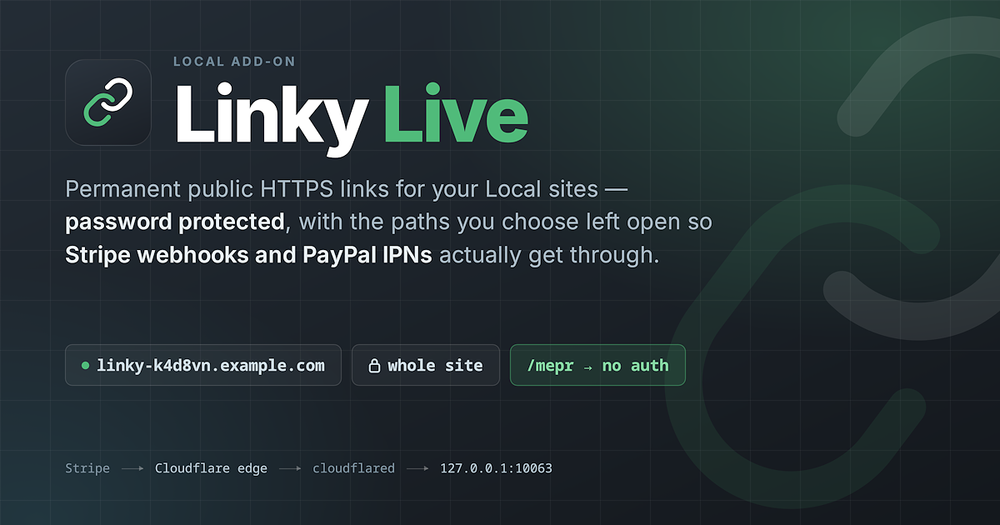

<p align="center">
  
</p>

# Linky Live

A [Local](https://localwp.com) add-on that gives any site a permanent public
HTTPS address, so remote services can reach it — Stripe webhooks, PayPal IPNs,
OAuth callbacks, or just showing a client your work.

The site is password protected, and you can whitelist specific paths that skip
the password so webhook listeners get through.

The Cloudflare Worker that backs it lives in
[Linky Live Worker](https://github.com/cartpauj/linky-live-worker).

---

## Why this exists

Local ships a Live Links feature, but it puts HTTP basic auth in front of the
**entire** site with no way to exempt anything. That makes it unusable for
testing inbound callbacks: Stripe, PayPal, and every other webhook sender gets a
`401` and gives up.

The auth is enforced on Flywheel's tunnel server (`*.localsite.io`), not on your
machine — Local just asks their Hub for a tunnel with
`auth: { type: 'basic', credentials }` and stores the pair in `sites.json`. There
is no local gate to disable and no way to whitelist a path. See
`main/localHubAPI/LocalHubAPIService.js` inside Local's `app.asar` if you want to
confirm it yourself.

So this replaces it end to end.

### What you get

| | |
| --- | --- |
| **Permanent URLs** | `https://linky-k4d8vn.example.com`, stable across restarts and reboots, so a webhook registered once with Stripe keeps working |
| **Password protected by default** | Username and password are editable per site by whoever owns it |
| **Per-path bypass** | Whitelist `/mepr` so a gateway listener gets through while the rest of the site stays locked. `/` and wildcards are refused |
| **Forced noindex** | While a link is on, search-engine indexing is forced off and cannot be re-enabled from wp-admin |
| **Opt-in per site** | Sites you never enable are left completely untouched |
| **One-click install** | A single `.tgz`, no dependencies, no build step, macOS/Windows/Linux |

---

Gives any Local site a permanent public HTTPS address, so remote services can
reach it — Stripe webhooks, PayPal IPNs, OAuth callbacks, or just showing a
client your work.

The site is password protected by default, and you can whitelist specific paths
that skip the password so webhook listeners get through.

## Requirements

Someone needs to be running a **Linky Live Worker** — the Cloudflare Worker that
allocates hostnames and guards them. It deploys to a Cloudflare account you
control, on a domain you own, and costs nothing on Cloudflare's free tier.

If nobody has set one up yet, start there:
[Linky Live Worker](https://github.com/cartpauj/linky-live-worker).

You will need two things from whoever runs it:

- the **service address**, e.g. `linky-live.example.com`
- your personal **API key**

## Install

1. Download `linky-live.tgz` from the releases page, or build it with
   `./scripts/build-addon.sh`.
2. In Local, open **Add-ons** and click **Browse to Add-on to install**.
3. Pick the file, enable it, and restart Local when prompted.

Works on macOS, Windows, and Linux. Nothing else to install — the tunnel client
(`cloudflared`) is downloaded automatically the first time you turn a link on,
into the add-on's own folder. It is never installed system-wide.

## First run

Open any site, click the **Linky Live** tab, and enter the service address and
your API key. Both are stored once on this computer and apply to every site, so
you are not asked again.

### Changing them later

The footer of the Linky Live tab shows which service and key are in use, with a
**Change key** link for rotating your key.

**The service address can only be changed by editing the file.** It is assumed to
be set once, so there is no field for it after setup. If your Linky Live Worker
moves to a different hostname, edit `settings.json` and restart Local:

| Platform | Path |
| --- | --- |
| macOS | `~/Library/Application Support/Local/linky-live/settings.json` |
| Windows | `%APPDATA%\Local\linky-live\settings.json` |
| Linux | `~/.config/Local/linky-live/settings.json` |

```json
{
  "apiKey": "linky_…",
  "controlHostname": "linky-live.example.com"
}
```

Store `controlHostname` as a bare hostname — no scheme, no trailing slash.
Deleting the file resets the add-on to its setup screen, which is the other way
to change the address.

## Using it

**Turn on** allocates a permanent address like `https://linky-k4d8vn.example.com` and
starts the tunnel.

**Turn off** stops the tunnel but keeps the address reserved. Turning it back on
gives you the same URL, so a webhook you registered with Stripe keeps working
across restarts and reboots.

**Release address** permanently gives the URL up. Only do this when you are done
with the site — anything pointing at that address breaks.

### Password protection

Every request needs the username and password shown in the tab. Both are
editable — set them to whatever you like and click **Save credentials**, or hit
**Generate new** for a fresh pair. Changes take effect immediately.

### Paths that skip the password

Payment gateways cannot send a password, so add the path their listener posts to:

```
/mepr                 MemberPress gateway listener
/wp-json/wc/v3        WooCommerce REST
/?wc-api=...          see the note below
```

Anything at or below a listed path is publicly reachable, so keep entries
specific. A bare `/` and wildcards are both rejected, because either would leave
the whole site open.

Matching respects path boundaries: `/mepr` covers `/mepr` and `/mepr/notify` but
not `/meprivate`.

> **Query-string endpoints.** Bypasses match on the path only. An endpoint like
> `/?wc-api=WC_Gateway_Paypal` has a path of `/`, which cannot be whitelisted.
> Point the service at a real path instead — most gateways offer a REST or
> permalink-style route.

## Search engines

While a site's live link is **on**, search engine indexing is forced off and
cannot be turned back on from Settings → Reading. It is enforced at runtime
rather than just written to the database once, so it also survives imports and
database restores, and it is re-asserted every time the site starts.

Responses through a live link additionally carry `X-Robots-Tag: noindex` from
the edge.

This only applies to sites you have switched the link on for. Turn the link off
and the enforcement stops; release the address and the file is removed.

## Opt-in per site

The addon does nothing to a site until you switch its live link on. Sites you
never enable are untouched — no mu-plugins, and their `mu-plugins` directory is
not even created.

Once a link is on it stays on across restarts: stopping the site stops the
tunnel, and starting it again brings the same URL back automatically. That keeps
a webhook you registered with Stripe working without you having to remember to
re-toggle anything.

**Turn off** stops the tunnel and ends the search-engine enforcement, but keeps
the URL reserved. **Release address** removes everything, including the
mu-plugin.

## Notes

- Your `.local` address is unaffected. URL rewriting only applies to requests
  arriving through the tunnel.
- Nothing is written to the database. The public hostname never gets saved into
  your options or post content.
- Turning a site off in Local stops its tunnel automatically.
- Logs go to Local's own log file; look for `LinkyLive` and `cloudflared`.
- The service address has no UI field after setup — see
  [Changing them later](#changing-them-later) to point the add-on at a different
  Worker.

## Repo layout

```
src/main.js        main process: hooks, IPC, cloudflared + mu-plugin lifecycle
src/renderer.js    the "Linky Live" tab (plain React.createElement, no build step)
src/styles.js      theme-aware CSS, follows Local's light/dark setting
src/cloudflared.js binary download + process management
src/api.js         thin client for the worker
mu-plugins/        linky-live-noindex.php, linky-live-urls.php
icon.png           shown in Local's Add-ons list
assets/            icon and banner artwork, and the HTML they render from
scripts/           build-addon.sh
test/              hooks, mu-plugin lifecycle, dark mode, platform mapping
```

## Build

```bash
./scripts/build-addon.sh     # produces dist/linky-live.tgz
```

Teammates install that file through Local's **Add-ons → Browse to Add-on to
install** button. The archive filename is intentionally unversioned: Local names
the installed folder after it, so a versioned name would leave stale copies
behind.

## How the add-on works

### Lifecycle

| Action | Effect |
| --- | --- |
| **Turn on** | Provisions (or reuses) a hostname, installs both mu-plugins, starts `cloudflared` |
| **Turn off** | Stops the tunnel and removes `linky-live-link.php`. **URL stays reserved** |
| Site stopped in Local | Tunnel stops, but the on/off choice is preserved |
| Site started in Local | If the link was on, it comes back automatically on the same URL |
| **Release address** | Deletes tunnel + DNS + route, removes both mu-plugins. Breaks any registered webhook |
| Never enabled | Site is completely untouched — not even a `mu-plugins` directory |

`enabled` (the saved choice) and `running` (is the process up) are tracked
separately, because they legitimately differ while a site is stopped. The UI
shows both, and also probes the site's port so it can distinguish "the link is
broken" from "the site it points at is not running" — the usual cause of a 502.

If a tunnel dies on its own, it is retried with Fibonacci backoff for up to 60
seconds. `unauthorized` and `notFound` are treated as fatal; a dropped network or
a laptop waking from sleep is retried.

### How URLs are made public

The database is never modified. WordPress continues to believe it lives at its
local address, which is what keeps Local's one-click admin login working (its
session cookie cannot survive a cross-domain redirect), keeps WordPress's own
loopback requests on the machine, and keeps the `.local` address usable while a
link is on.

Two things make the public hostname appear instead:

1. **`linky-live-link.php`** filters the URLs WordPress generates, and sends an
   `X-Local-Host` header naming the local host and port.
2. **The Worker rewrites the response body**, replacing that local host with the
   public one. This is what fixes URLs hardcoded in post content, which no PHP
   filter can reach.

Neither runs unless the request arrived through the gateway: the mu-plugin checks
for the `X-Linky-Live` marker the Worker always sets.

The rewrite is kept cheap — the free plan allows 10ms CPU per request:

- non-text responses are returned as the original object, so no stream is built
  and no bytes are decoded
- only `text/html`, JSON and XML are rewritten; CSS and JS asset URLs are
  generated by PHP and already correct
- the origin is asked for `Accept-Encoding: identity`, so there is nothing to
  decompress in JS
- one needle, `split`/`join`, no regex

A match can straddle a chunk boundary, so replacement happens across the whole
buffer before anything is emitted, holding back a needle's length between chunks.

### The two mu-plugins

- **`linky-noindex.php`** — filters `pre_option_blog_public` and
  `pre_update_option_blog_public` to `0`. Enforced at runtime, so it cannot be
  switched off in Settings → Reading and survives imports and database restores.
- **`linky-live-link.php`** — points generated URLs at the public host, fixes
  `$_SERVER['HTTPS']` (TLS terminates at the edge, so PHP sees plain HTTP and
  would otherwise redirect-loop), sends `X-Local-Host`, and rewrites the public
  host back out of anything headed for the database.

### cloudflared

Downloaded once per machine from GitHub releases into the add-on's data
directory, or an existing system `cloudflared` is used if present. Linux and
Windows ship bare executables; macOS ships a `.tgz` that gets extracted.

Remotely-managed tunnels carry their own ingress config, so the add-on only needs
`cloudflared tunnel run --token <token>` — no config file, no `cloudflared login`.

---

## Development

```bash
node --test test/            # no dependencies needed
./scripts/build-addon.sh     # dist/linky-live.tgz
```

### Versioning

`package.json` is the single source of truth. Local reads it directly and shows
the version in its Add-ons list, and **de-duplicates add-ons by name and
version** — so a build claiming a higher version will shadow a lower one, even if
the lower one is newer in real time. Keep the number honest.

The add-on also talks to a [Linky Live
Worker](https://github.com/cartpauj/linky-live-worker) over a wire contract: the
`X-Linky-Live` and `X-Local-Host` headers and the `/v1/*` endpoints. The Worker
reports its own version on `/v1/status`, so the two can be checked against each
other.

### Releasing

Pushing a `vX.Y.Z` tag builds the archive and publishes it as a GitHub release.

```bash
# 1. bump the version in package.json and commit
# 2. tag it, matching exactly
git tag v0.0.2
git push origin v0.0.2
```

The workflow refuses to publish if the tag and `package.json` version disagree,
because Local de-duplicates add-ons by name and version — a mismatch means the
installed add-on reports a different version than the release it came from. It
also runs the tests and lints the mu-plugins first, so a broken build cannot ship.

The release asset is always named `linky-live.tgz`, without a version. Local names
the installed folder after the archive, so a versioned filename would leave a
stale copy behind on every upgrade.

### CI

Pushes and pull requests run the tests, lint the mu-plugins with `php -l` — the
Node tests cannot parse PHP, so a syntax error there would otherwise only surface
when a site tried to load one — and verify the archive still builds.

### Iterating on the add-on

Local's `addon-development.json` has `enabled: true`, so a plain folder in the
add-ons directory is loaded without packaging. Symlink instead of reinstalling a
`.tgz` each time:

```bash
ln -s "$PWD" ~/.config/Local/addons/linky-live   # Linux
# macOS:   ~/Library/Application Support/Local/addons/
# Windows: %APPDATA%\Local\addons\
```

Restart Local to pick up changes. Add-on logs go to Local's own log file — look
for `LinkyLive` and `cloudflared`.

### Notes for whoever picks this up

- The add-on ships **unbundled on purpose**. Don't add webpack; it would break the
  runtime alias trick that makes install a single file with no dependencies.
- `assets/source-preview.html` is the source the icon and banner render from.
- Manifest fields `icon` and `color` are real Local features — locally-installed
  add-ons resolve `path.join(addonDir, icon)`, and `color` becomes the card
  background.

---

## License

GPL-3.0-or-later. See [LICENSE](LICENSE).
